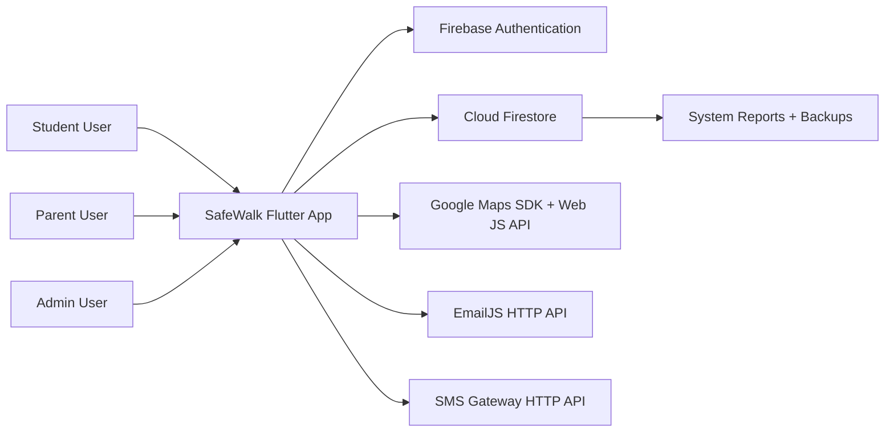
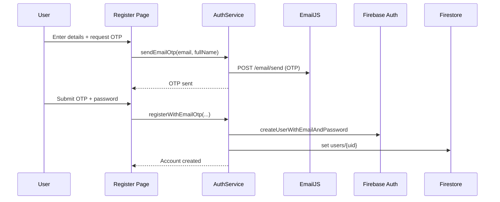
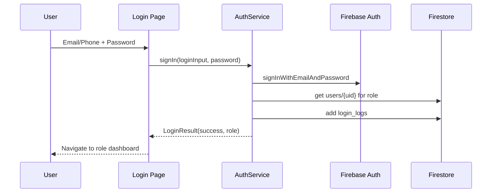
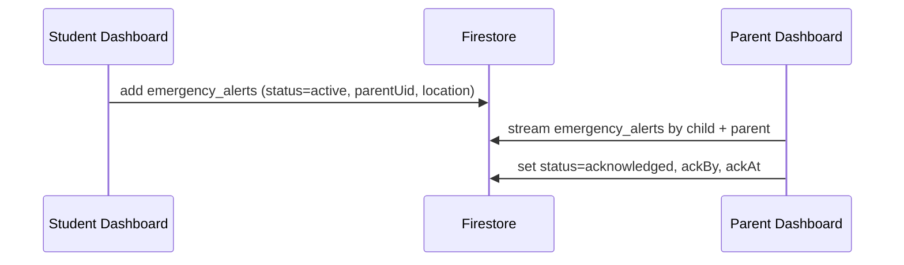
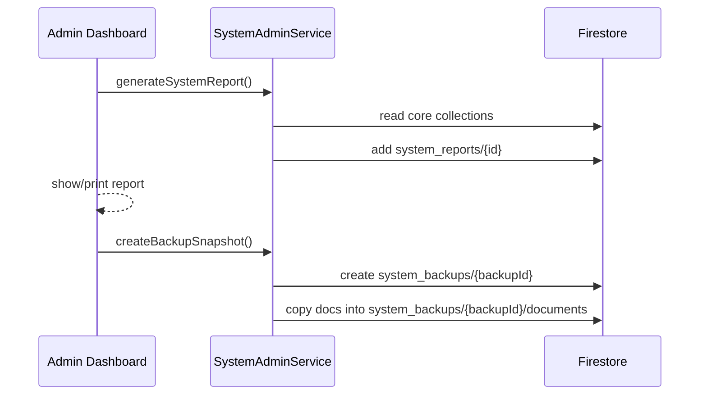

# SafeWalk System Architecture

_Last updated: March 28, 2026_

## 1) Architecture Scope

This document describes the current `as-built` architecture of the SafeWalk project based on the Flutter code in this repository.

Primary goals covered by the system:
- Role-based access for `admin`, `student`, and `parent`
- Student safety monitoring and SOS workflow
- Parent-student linking and invitation flow
- Admin reporting and backup snapshots
- Email/SMS integration hooks and delivery logging

## 2) Context Diagram



## 3) Container / Component Architecture

```mermaid
graph TD
    subgraph Client[Flutter Client (Web + Mobile)]
      UI[UI Layer\nlanding/login/register\nadmin dashboard\nstudent dashboard\nparent dashboard]
      AuthSvc[AuthService]
      NotifSvc[NotificationService]
      AdminSvc[SystemAdminService]
      PrintSvc[PrintService\n(web implementation + stub)]
      MapsGuard[GoogleMaps Web Guard]
    end

    UI --> AuthSvc
    UI --> NotifSvc
    UI --> AdminSvc
    UI --> PrintSvc
    UI --> MapsGuard

    AuthSvc --> FirebaseAuth[Firebase Auth]
    AuthSvc --> Firestore[(Cloud Firestore)]
    AuthSvc --> EmailJS

    NotifSvc --> Firestore
    NotifSvc --> EmailJS
    NotifSvc --> SMS

    AdminSvc --> Firestore
    PrintSvc --> BrowserPrint[Browser Print Window]
    MapsGuard --> GoogleMapsJS[Google Maps JS availability check]
```

### Main module responsibilities

- `main.dart`: initializes Firebase and routes to `LandingPage` on web, otherwise `LoginPage`
- `auth/auth_service.dart`: login, registration, OTP email sending, password reset, login audit logs
- `User/user_dashboard.dart`: student profile/settings, parent invitation handling, SOS creation, map and alert history
- `User/parent_dashboard.dart`: linked student monitoring, invitation sending, alert acknowledgment, child map and status
- `admin/admin_dashboard.dart`: user/device/alert/log views, report generation, print, backup, test notifications
- `services/notification_service.dart`: outbound email/SMS calls and logging to Firestore
- `services/system_admin_service.dart`: report aggregation and Firestore snapshot backup

## 4) Key Runtime Flows

### 4.1 Registration with Email OTP



### 4.2 Login and role routing



### 4.3 SOS and parent response



### 4.4 Admin report and backup



## 5) Firestore Data Model (Current)

| Collection | Purpose | Key fields (observed) |
|---|---|---|
| `users` | User profile + role | `uid`, `fullName`, `email`, `phoneNumber`, `role`, `createdAt` |
| `user_settings` | Per-user preferences | `alertsEnabled`, `safeModeEnabled`, `locationSharingEnabled`, `smsAlertsEnabled`, `emailAlertsEnabled`, `childUid`, `updatedAt` |
| `devices` | Device registry / location source | `deviceId`, `deviceName`, `phoneNumber`, `location`, `status`, `createdAt`, optional coordinates |
| `parent_student_invitations` | Invitation workflow | `parentUid`, `studentUid`, normalized phones, `status`, `createdAt`, `updatedAt`, `respondedAt` |
| `parent_student_links` | Accepted parent-student links | parent/student IDs and names, normalized phones, `status`, `linkedAt`, `updatedAt` |
| `emergency_alerts` | SOS and alert timeline | student/user IDs, parent IDs, `type`, `severity`, `status`, `message`, `location`, `coordinates`, `timestamp`, `ackBy`, `ackAt` |
| `login_logs` | Authentication audit trail | `uid`, `loginInput`, `email`, `status`, `role`, `location`, `deviceId`, `reason`, `timestamp` |
| `sms_logs` | SMS delivery audit | `phoneNumber`, `message`, `status`, provider response fields, `timestamp` |
| `email_logs` | Email delivery audit | `toEmail`, `subject`, `status`, provider response fields, `timestamp` |
| `system_reports` | Generated admin reports | `generatedAt`, `counts`, `failedLoginSamples`, `recentAlerts`, `createdAt` |
| `system_backups` | Backup metadata | `status`, `collections`, `totalDocuments`, timestamps |
| `system_backups/{id}/documents` | Backup payload docs | `collection`, `sourceId`, `data`, `createdAt` |
| `walk_sessions` | Child route/session status | `uid`, `route`, `distanceKm`, `status` |

## 6) Deployment View

- Frontend runtime: Flutter (Web/Android/iOS/Desktop targets in repo)
- Backend runtime: Firebase Authentication + Cloud Firestore
- External providers:
- Email: EmailJS (`https://api.emailjs.com/api/v1.0/email/send`)
- SMS: configurable HTTP gateway (`lib/config/sms_config.dart`)
- Maps: `google_maps_flutter` with web JS readiness guard

## 7) Current Architectural Notes

- This is a client-heavy architecture (business logic in Flutter pages/services).
- Firestore is the system of record for operational data and logs.
- Real-time monitoring is implemented via Firestore snapshot streams.
- Notification sending exists, but automatic alert-to-SMS/email fan-out is not yet wired from SOS events.
- OTP state is in-memory inside `AuthService`; it resets when app process/session restarts.

## 8) Recommended Next Architecture Step

Introduce a backend automation layer (Firebase Cloud Functions) for:
- server-side OTP issuance/verification
- automatic SMS/email fan-out on new active `emergency_alerts`
- centralized role/permission enforcement and immutable audit trails

This keeps the current UI architecture while making security and reliability stronger.
